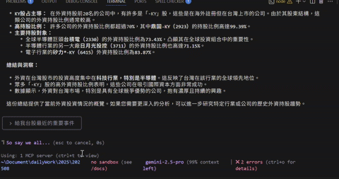

# 🚀 TWStockMCPServer

[](https://opensource.org/licenses/MIT)
[](https://www.python.org/downloads/)
[](https://modelcontextprotocol.io/)
[](https://github.com/twjackysu/TWStockMCPServer/actions/workflows/api-tests.yml)

一個全面的**模型上下文協議 (MCP) 伺服器**，專為台灣證券交易所 (TWSE) 數據分析設計，提供即時股票資訊、財務報表、ESG 數據和趨勢分析功能。

<a href="https://glama.ai/mcp/servers/@twjackysu/TWSEMCPServer">
  
</a>

## 🌏 語言版本

- [English](README_en-us.md) | **繁體中文**

## 🎬 示範影片

### VSCode Copilot demo


### Gemini CLI demo


*觀看 TWStockMCPServer 功能展示*

## ✨ 五大投資分析情境

### 📊 **個股趨勢研判**
短中長期技術面、基本面、籌碼面綜合分析
> *"分析台積電(2330)最近的走勢" / "鴻海(2317)適合長期投資嗎？"*

### 💰 **外資投資解讀**
外資持股、產業流向、個股進出追蹤
> *"外資最近在買什麼股票？" / "半導體業外資投資趨勢如何？"*

### 🔥 **市場熱點捕捉**
重大訊息、異常成交、權證活躍度監控
> *"今天有什麼重大消息？" / "哪些股票交易量異常活躍？"*

### 💎 **股利投資規劃**
高殖利率篩選、除權息行事曆、配息穩定性分析
> *"推薦一些高殖利率股票" / "下個月有哪些公司要除權息？"*

### 🎯 **投資標的篩選**
價值股/成長股篩選、ESG風險評估
> *"幫我找一些被低估的價值股" / "ESG表現好的公司有哪些？"*

## 📈 API 整合進度

目前進度：**38/143 (26.6%)** 已完成 ✅

想了解詳細的API覆蓋情況？查看我們的 **[API TODO List](API_TODO.md)** 追蹤實作進度！

> 💡 執行 `python generate_todo.py` 可自動更新進度統計

## ⚙️ 快速開始

### 🚀 線上使用（推薦）
```json
{
  "twstockmcpserver": {
    "transport": "streamable_http",
    "url": "https://TW-Stock-MCP-Server.fastmcp.app/mcp"
  }
}
```

### 🔧 本地安裝
```bash
git clone https://github.com/twjackysu/TWStockMCPServer.git
cd TWStockMCPServer
uv sync && uv run fastmcp dev server.py
```

## 🤝 參與貢獻
歡迎PR！查看現有[API列表](API_TODO.md)了解可擴展的功能。

## 📄 授權 & 免責聲明
MIT授權 | 僅供參考，不構成投資建議

