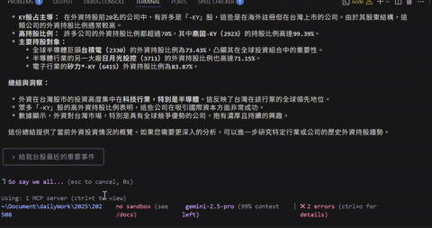

# 🚀 TWStockMCPServer

[](https://opensource.org/licenses/MIT)
[](https://www.python.org/downloads/)
[](https://modelcontextprotocol.io/)
[](https://github.com/twjackysu/TWStockMCPServer/actions/workflows/api-tests.yml)

一個全面的**模型上下文協議 (MCP) 伺服器**，專為台灣證券交易所 (TWSE) 數據分析設計，提供即時股票資訊、財務報表、ESG 數據和趨勢分析功能。


## 🌏 語言版本

- [English](README_en-us.md) | **繁體中文**

## 🎬 示範影片

### VSCode Copilot demo


### Gemini CLI demo


*觀看 TWStockMCPServer 功能展示*

## ✨ 五大投資分析情境

### 📊 **個股趨勢研判**
短中長期技術面、基本面、籌碼面綜合分析
> *"分析台積電(2330)最近的走勢" / "鴻海(2317)適合長期投資嗎？"*

### 💰 **外資投資解讀**
外資持股、產業流向、個股進出追蹤
> *"外資最近在買什麼股票？" / "半導體業外資投資趨勢如何？"*

### 🔥 **市場熱點捕捉**
重大訊息、異常成交、權證活躍度監控
> *"今天有什麼重大消息？" / "哪些股票交易量異常活躍？"*

### 💎 **股利投資規劃**
高殖利率篩選、除權息行事曆、配息穩定性分析
> *"推薦一些高殖利率股票" / "下個月有哪些公司要除權息？"*

### 🎯 **投資標的篩選**
價值股/成長股篩選、ESG風險評估
> *"幫我找一些被低估的價值股" / "ESG表現好的公司有哪些？"*

## 🧮 進階功能

### 期貨籌碼與選擇權分析
Put/Call Ratio、大額交易人未沖銷部位、三大法人期貨/選擇權部位
> *"台指期籌碼現在偏多還是偏空？" / "選擇權大額交易人在哪個價位布局？"*

### 三大法人籌碼流向
上市/上櫃三大法人買賣超、外資產業配置
> *"三大法人今天買超哪些股票？" / "外資在哪個產業加碼？"*

### 個股財報體檢
獲利能力、成長性、財務結構、配息政策、公司治理五面向分析
> *"幫我做台積電的財報體檢" / "這家公司的財務體質健不健康？"*

### 買前風險掃描
處置股、注意股、當沖限制、停資停券名單比對
> *"這檔股票買進前有沒有被列處置或注意？"*

### 期貨/三大法人歷史回溯查詢
openapi.taifex.com.tw 僅提供最新一個交易日，本專案額外串接期交所網站下載頁面
（`www.taifex.com.tw`），可回溯查詢台指期等期貨每日OHLC歷史、三大法人期貨部位歷史
> *"幫我拉台指期最近一個月的每日OHLC" / "外資期貨部位過去三個月怎麼變化？"*

## ⚙️ 快速開始

### 🚀 線上使用（由 [Prefect Horizon](https://horizon.prefect.io/) 提供支援）

本專案由 **Prefect Horizon** 提供支援，免費託管線上 remote MCP Server：
```json
{
  "twstockmcpserver": {
    "transport": "streamable_http",
    "url": "https://TW-Stock-MCP-Server.fastmcp.app/mcp"
  }
}
```

> ⚠️ **使用限制**：為維持服務永續，此線上服務設有合理使用量上限（非無限制）。若需**商業使用**或較高呼叫量，強烈建議改用下方 Docker／本機方式自行架設伺服器，或使用 [Prefect Horizon](https://horizon.prefect.io/) 的付費方案。
>
> 🙏 感謝 [Prefect Horizon](https://horizon.prefect.io/) 支援本開源專案，讓社群能免費輕鬆試用。

### 🐳 Docker 使用（stdio）
```json
{
  "twstockmcpserver": {
    "command": "docker",
    "args": [
      "run",
      "-i",
      "--rm",
      "--pull=always",
      "-e",
      "MCP_STDIO=1",
      "ghcr.io/twjackysu/twsemcpserver:latest"
    ]
  }
}
```

### 🔧 本地安裝
```bash
git clone https://github.com/twjackysu/TWStockMCPServer.git
cd TWStockMCPServer
uv sync && uv run fastmcp dev server.py
```

## 📡 資料來源

| 來源 | 說明 | Tools |
|------|------|-------|
| [TWSE OpenAPI](https://openapi.twse.com.tw) | 台灣證交所官方 API — 公司治理、ESG、財報、交易、指數等 | 143 個 |
| [TWSE Web API](https://www.twse.com.tw) | 證交所網頁 API — 個股日K、月均價、估值、融資融券、上市三大法人買賣超（金額/股數）、全市場收盤行情、加權指數歷史、外資持股歷史、個股月/年成交彙總、鉅額交易明細、融券借券餘額/成交 | 16 個 |
| [MIS 即時報價](https://mis.twse.com.tw) | 盤中即時多股報價（上市+上櫃） | 1 個 |
| [TPEx OpenAPI](https://www.tpex.org.tw/openapi) | 櫃買中心 — 上櫃日收盤、三大法人（個股/彙總）、本益比、融資融券、注意/處置股、除權息、零股、指數 | 10 個 |
| [TAIFEX OpenAPI](https://openapi.taifex.com.tw) | 期交所 — 三大法人系列、大額交易人部位、每日行情、選擇權分析、保證金、年月統計 | 16 個 |
| [TAIFEX 網站下載](https://www.taifex.com.tw) | 期交所網站歷史資料下載頁面 — 期貨每日OHLC歷史、三大法人期貨部位歷史、Put/Call Ratio歷史、三大法人選擇權買賣權分計歷史、大額交易人未沖銷部位歷史、選擇權每日OHLC歷史、三大法人期貨+選擇權總表歷史、三大法人期貨/選擇權分計歷史、三大法人各選擇權契約歷史（openapi.taifex.com.tw 僅提供最新一日，無歷史查詢功能） | 9 個 |

## 🤝 參與貢獻
歡迎PR！

## 📄 授權 & 免責聲明
MIT授權 | 僅供參考，不構成投資建議

