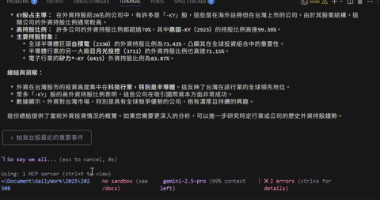

# 🚀 TWStockMCPServer

[](https://opensource.org/licenses/MIT)
[](https://www.python.org/downloads/)
[](https://modelcontextprotocol.io/)
[](https://github.com/twjackysu/TWStockMCPServer/actions/workflows/api-tests.yml)

A comprehensive **Model Context Protocol (MCP) server** designed for Taiwan Stock Exchange (TWSE) data analysis, providing real-time stock information, financial statements, ESG data, and trend analysis functionality.


## 🌏 Language Versions

- **English** | [繁體中文](README.md)

## 🎬 Demo

### VSCode Copilot demo


### Gemini CLI demo


*Watch TWStockMCPServer in action*

## ✨ Five Investment Analysis Scenarios

### 📊 **Individual Stock Trend Analysis**
Comprehensive analysis combining technical, fundamental, and institutional trading perspectives
> *"Analyze TSMC (2330) recent trends" / "Is Hon Hai (2317) suitable for long-term investment?"*

### 💰 **Foreign Investment Insights**
Foreign holdings, industry flows, and individual stock entry/exit tracking
> *"What stocks are foreign investors buying recently?" / "How are foreign investment trends in semiconductors?"*

### 🔥 **Market Hotspot Detection**
Major announcements, abnormal trading volumes, warrant activity monitoring
> *"What major news happened today?" / "Which stocks have abnormal trading volumes?"*

### 💎 **Dividend Investment Planning**
High-yield screening, ex-dividend calendar, payout stability analysis
> *"Recommend some high-yield stocks" / "Which companies go ex-dividend next month?"*

### 🎯 **Investment Screening**
Value/growth stock selection, ESG risk assessment
> *"Help me find some undervalued stocks" / "Which companies have good ESG performance?"*

## 🧮 Advanced Features

### Futures & Options Positioning
Put/Call ratio, large-trader open interest, 三大法人 futures/options positions
> *"Is TX futures positioning bullish or bearish right now?" / "Where are large options traders positioned?"*

### Institutional Investor Flow
TWSE/OTC 三大法人 buy/sell, foreign investment by industry
> *"What are institutional investors buying today?" / "Which industry are foreign investors adding to?"*

### Company Fundamental Health Check
Profitability, growth, balance sheet, dividend policy, governance across five dimensions
> *"Give me a fundamental health check on TSMC" / "Is this company's financial health solid?"*

### Pre-Trade Risk Scan
Cross-checks disposal/warning/day-trading-restriction/margin-restriction lists
> *"Is this stock flagged for disposal or under a warning before I buy?"*

### Futures / Institutional Historical Lookback
openapi.taifex.com.tw only ever returns the latest trading day. This project reads TAIFEX's
own website download pages (`www.taifex.com.tw`) instead: the latest trading day by default,
or any past period — futures/options daily market reports, 三大法人 positions, large-trader OI
> *"Pull me a month of daily OHLC for TX futures" / "How has the foreign futures position changed over the last quarter?"*

### Multi-Period Financials, Revenue & Dividends
Financial statements, monthly revenue and dividends come from MOPS (公開資訊觀測站) for listed,
OTC, emerging and public companies alike: the latest period by default, or any past quarter's income
statement, balance sheet and **cash-flow statement**, multi-month revenue, multi-year dividend
history, and the investor-conference calendar; plus full-text material information, directors'
holdings and pledges, insiders' monthly holding changes, treasury-stock buybacks, and
endorsements/guarantees and fund lending
> *"Compare TSMC's gross margin and free cash flow over the last four quarters" / "Has Hon Hai's dividend been stable for five years?"*

### Shareholder Concentration & OTC History
TDCC shareholding distribution (big-holder vs. retail ratios); OTC per-stock daily OHLC,
三大法人 and margin balances for any past date; TWSE day-trading stats, ex-rights results and
sector index history
> *"What share of GlobalWafers do 1,000-lot holders own?" / "How did the semiconductor index do last month?"*

### Macro
NDC business-cycle signal (景氣燈號) and leading/coincident/lagging indicators, Taiwan PMI/NMI,
central-bank daily exchange rates
> *"What color is the business-cycle signal now?" / "Has the TWD strengthened this month?"*

## ⚙️ Quick Start

### 🚀 Online Usage (powered by [Prefect Horizon](https://horizon.prefect.io/))

This project is powered by **Prefect Horizon**, which hosts a free remote MCP Server:
```json
{
  "twstockmcpserver": {
    "transport": "streamable_http",
    "url": "https://TW-Stock-MCP-Server.fastmcp.app/mcp"
  }
}
```

> ⚠️ **Usage limit**: To keep the service sustainable, it has a fair-use ceiling (not unlimited). For **commercial use** or higher call volumes, we strongly recommend self-hosting via Docker / local install below, or a [Prefect Horizon](https://horizon.prefect.io/) paid plan.
>
> 🙏 Thanks to [Prefect Horizon](https://horizon.prefect.io/) for supporting this open-source project, making it easy for the community to try it out for free.

### 🐳 Docker (stdio)
```json
{
  "twstockmcpserver": {
    "command": "docker",
    "args": [
      "run",
      "-i",
      "--rm",
      "--pull=always",
      "-e",
      "MCP_STDIO=1",
      "ghcr.io/twjackysu/twsemcpserver:latest"
    ]
  }
}
```

### 🔧 Local Installation
```bash
git clone https://github.com/twjackysu/TWStockMCPServer.git
cd TWStockMCPServer
uv sync && uv run fastmcp dev server.py
```

## 📡 Data Sources

| Source | Description | Tools |
|--------|-------------|-------|
| [TWSE OpenAPI](https://openapi.twse.com.tw) | Taiwan Stock Exchange official API — corporate governance, ESG, financial ratios, announcement lists, warrants, brokers, etc. | 106 |
| [TWSE Web API](https://www.twse.com.tw) | TWSE web API endpoints (latest trading day by default, any past date on request) — daily OHLC, monthly avg price, valuation, margin balance, listed stocks institutional investors (amounts/shares), whole-market daily close, TAIEX index history, foreign holdings history, per-stock monthly/yearly summaries, block trade detail, short-sale/lending balance & trades, ex-rights/dividend results, day-trading targets & statistics, all index closes incl. sector indices (latest or any past date) | 19 |
| [MIS Real-time Quotes](https://mis.twse.com.tw) | Intraday real-time multi-stock quotes (listed + OTC) | 1 |
| [TPEx OpenAPI](https://www.tpex.org.tw/openapi) | TPEx OTC market — daily close (latest day; past dates come from the website), institutional investors summary, warning/disposal stocks, odd-lot, index | 6 |
| [TAIFEX OpenAPI](https://openapi.taifex.com.tw) | TAIFEX derivatives — options large-trader OI, options analytics (delta / OI change), margin, statistics | 7 |
| [TAIFEX website downloads](https://www.taifex.com.tw) | TAIFEX's own data-download pages — futures / options daily market reports, 三大法人 (futures/options split, totals, by contract, calls/puts), futures large-trader OI, Put/Call Ratio (latest trading day by default, any past period on request; openapi.taifex.com.tw only returns the latest day) | 9 |
| [MOPS](https://mops.twse.com.tw) | Market Observation Post System — income statement / balance sheet / cash-flow statement, monthly revenue, dividends (latest by default, any past period on request; listed, OTC, emerging and public companies), material information with full text, directors' holdings and pledges, insiders' monthly holding changes, treasury-stock buybacks, endorsements/guarantees and fund lending, investor conferences | 11 |
| [TPEx website](https://www.tpex.org.tw) | TPEx website JSON — OTC per-stock daily OHLC, 三大法人, margin balances, P/E / yield / P/B, foreign-holding ranking, ex-rights/dividend results (latest trading day by default, or any past date) | 6 |
| [TDCC open data](https://opendata.tdcc.com.tw) | Shareholding distribution by holding size (latest week, incl. big-holder / retail ratios) | 1 |
| [National Development Council](https://data.gov.tw/dataset/6099) | Business-cycle signal & indicators (since 1982), Taiwan PMI/NMI | 2 |
| [Central Bank](https://cpx.cbc.gov.tw) | Daily TWD and major trading-partner currencies vs. USD (since 1993) | 1 |
| Derived analytics (computed from the above) | Ex-rights-adjusted daily prices, technical indicators (MA, KD, RSI, MACD, Bollinger), valuation screener, industry peer comparison (listed + OTC) | 4 |

## 🤝 Contributing
PRs welcome!

## 📄 License & Disclaimer
MIT License | For reference only, not investment advice